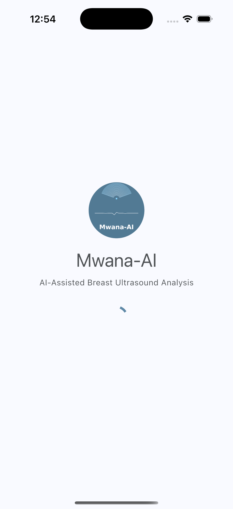
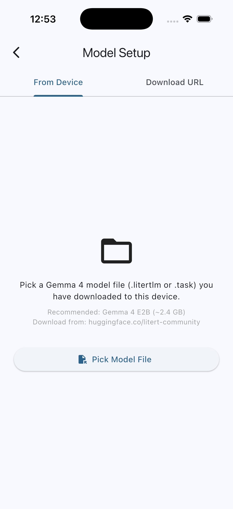
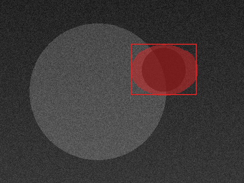
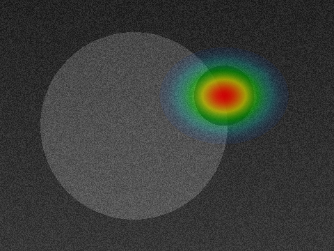

# Mwana-AI

AI-assisted breast cancer screening iOS app. Analyses breast ultrasound images entirely on-device — no patient data ever leaves the phone.

---

## Screenshots

<table>
  <tr>
    <td align="center"><br/><sub>Splash Screen</sub></td>
    <td align="center"><br/><sub>Model Setup</sub></td>
    <td align="center"><br/><sub>Original Ultrasound</sub></td>
    <td align="center"><br/><sub>Bounding Box Overlay</sub></td>
    <td align="center"><br/><sub>Grad-CAM Heatmap</sub></td>
  </tr>
</table>

> Heatmap screenshots are rendered from a synthetic test ultrasound via `dart run tool/test_heatmap.dart`. Full-workflow screenshots (analysis, cumulative report) require the on-device ONNX and Gemma models.

---

## What It Does

### Single-Image Workflow

1. Pick a breast ultrasound image — Camera, Photo Library, Files app, or **Butterfly iQ probe**
2. On-device ONNX inference classifies the image as **Benign / Malignant / Normal** and segments the lesion boundary
3. An ACR BI-RADS category (1 / 2 / 3 / 4A / 4B / 4C–5) is assigned
4. The segmentation mask is rendered as a colour overlay with a bounding box
5. Tap the image to open the **full-screen viewer** — toggle between Original, Bounding Box, and Grad-CAM Heatmap with pinch-to-zoom
6. On-device Gemma 4 generates a structured clinical report (falls back to a deterministic template if the model is not loaded)
7. Export the report as a PDF via the iOS share sheet

### Multi-Section Probe Workflow

When using the Butterfly iQ probe, the examiner captures **multiple breast sections** in a single session:

1. Connect the Butterfly iQ probe — the app authenticates automatically using the embedded client key
2. Capture Section 1, Section 2, … Section N (thumbnail strip shows all captured frames)
3. Tap **Analyse N** — the app runs sequential ONNX inference on every section
4. A **Cumulative Report** screen shows:
   - Per-section BI-RADS classifications with sortable confidence bars
   - Bounding box and heatmap thumbnails (tappable) for each section
   - An overall worst-case BI-RADS banner; **"Most Concerning"** section badge only appears when sections genuinely differ
   - AI-generated narrative from Gemma 4 covering all sections
   - Editable report fields (Clinical Indication, Findings, BI-RADS, Impression, Recommendation)
   - Export PDF based on the most concerning section

Everything runs offline after the initial model download.

---

## Requirements

| Requirement | Version |
|---|---|
| iOS | 18.0 or later |
| Flutter | 3.44.2 or later |
| CocoaPods | 1.16.0 or later |
| Xcode | 16.3 or later |
| ONNX model | `model_simplified.onnx` (~199 MB, not included in repo) |
| Gemma 4 model | `.litertlm` file installed via the app's model setup screen (~2.4 GB) |

---

## Getting Started

### 1. Clone and install dependencies

```bash
git clone https://github.com/Isaackjoshua/mwana-ai-ios.git
cd mwana-ai-ios
flutter pub get
cd ios && pod install && cd ..
```

### 2. Add the ONNX model

The model file is excluded from git (~199 MB). Copy it into the assets folder:

```bash
cp /path/to/model_simplified.onnx assets/models/
```

The source model lives at `BUSI.project/BUSI/model_export/model_simplified.onnx` in the companion training repository (https://github.com/Isaackjoshua/Breast_Ultrasound_Images_Model).

### 3. Configure the Butterfly iQ probe (optional)

If you have a Butterfly iQ SDK licence, add your client key to the gitignored config file:

```bash
# ios/Flutter/ButterflyConfig.xcconfig  (already gitignored)
BUTTERFLY_CLIENT_KEY = XXXXXX-XXXXXX-XXXXXX-XXXXXX-XXXXXX-V3
```

The key is injected into `Info.plist` at build time. **Never commit it to git.**

### 4. Build and deploy

```bash
# Run on a connected device (debug)
flutter run

# Build release IPA, then install wirelessly
flutter build ios --release
xcrun devicectl device install app \
  --device <device-udid> \
  build/ios/iphoneos/Runner.app
```

> `flutter run --release` may fail with a `TARGET_BUILD_DIR` error on some Xcode versions. Use the build-then-install pattern above for release builds.

### 5. Load the Gemma 4 model

On first launch the app opens the **Model Setup** screen. Tap **From Device** and select your `.litertlm` Gemma 4 model file, or use **Download URL** to pull it from HuggingFace (requires a HuggingFace access token).

---

## Project Structure

```
lib/
├── main.dart
├── app.dart                              ← MaterialApp + named routes
├── models/
│   ├── classification_result.dart        ← predicted class, probabilities, BI-RADS, sortedBars()
│   ├── segmentation_result.dart          ← binary mask, bounding box, probabilityMap
│   ├── inference_result.dart             ← classification + segmentation combined
│   ├── section_analysis.dart             ← one captured probe section (result + overlay + heatmap bytes)
│   ├── report_result.dart                ← 5 clinical report sections
│   ├── probe_state.dart                  ← Butterfly iQ connection state
│   └── patient_context.dart             ← optional patient metadata
├── services/
│   ├── image_picker_service.dart         ← camera / gallery / Files access
│   ├── image_preprocessor.dart           ← resize → normalise → CHW Float32 tensor
│   ├── ultrasound_validator.dart         ← reject non-ultrasound images
│   ├── onnx_inference_service.dart       ← 2-way TTA + malignant threshold override
│   ├── onnx_session_runner.dart          ← ONNX Runtime session wrapper
│   ├── default_ort_session_runner.dart   ← default ORT session runner
│   ├── birads_service.dart               ← probability → BI-RADS category
│   ├── overlay_renderer.dart             ← binary mask → annotated PNG with bounding box
│   ├── heatmap_renderer.dart             ← sigmoid probability map → jet-colourmap PNG
│   ├── butterfly_probe_service.dart      ← Butterfly iQ platform channel bridge
│   ├── local_gemma_report_service.dart   ← Gemma 4 single + cumulative report + template fallback
│   ├── model_manager_service.dart        ← install / check Gemma 4 model
│   └── pdf_export_service.dart           ← build PDF, share via iOS share sheet
└── screens/
    ├── splash_screen.dart
    ├── model_setup_screen.dart
    ├── input_selection_screen.dart       ← camera / gallery / files / Butterfly iQ buttons
    ├── image_confirm_screen.dart
    ├── probe_connect_screen.dart         ← Butterfly iQ connection & authentication
    ├── probe_imaging_screen.dart         ← live preview + multi-section capture strip
    ├── multi_analysis_screen.dart        ← sequential ONNX inference on N sections
    ├── analysis_screen.dart              ← single-image results with tappable overlay
    ├── image_viewer_screen.dart          ← 3-way toggle viewer (Original / BBox / Heatmap)
    ├── cumulative_report_screen.dart     ← per-section cards + overall BI-RADS + editable report
    ├── report_screen.dart
    └── export_screen.dart

tool/
└── test_heatmap.dart                     ← standalone visual test for heatmap & overlay renderers
```

---

## AI Model Details

### ONNX Classification + Segmentation Model

- **Architecture**: ResNet50 U-Net v10
- **Format**: ONNX FP32 (~199 MB)
- **Input**: `image` — `[1, 3, 256, 256]` CHW Float32, ImageNet-normalised
- **Outputs**:
  - `cls_logits` — `[1, 3]` raw logits → softmax → [benign, malignant, normal]
  - `seg_logits` — `[1, 1, 256, 256]` raw logits → sigmoid → probability map → binary mask
- **TTA**: two passes (original + horizontal flip), results averaged
- **Malignant safety threshold**: if P(malignant) ≥ 0.35, class is forced to malignant regardless of argmax; a warning is displayed in the UI

### Heatmap Visualisation

The app exposes the U-Net's own sigmoid probability map as a **Grad-CAM-style heatmap** — no backpropagation required:

- Probability map (256×256) is bilinearly upsampled to the original image dimensions
- Mapped through a **jet colourmap**: blue (low probability) → cyan → yellow → red (high probability)
- Pixels below 0.08 probability are left as original; max overlay opacity is 78%
- Rendered live alongside the bounding-box overlay for every inference

### Gemma 4 (on-device LLM)

- Runs via `flutter_gemma` (LiteRT/MediaPipe backend)
- Generates structured BI-RADS reports from numerical model findings
- `generateCumulativeReport()` accepts all N sections, identifies the worst-case section, and produces a multi-section narrative
- Falls back to a deterministic class-specific (or multi-section) template if the model is not loaded or unavailable

---

## BI-RADS Assignment

| Prediction | Confidence | Category |
|---|---|---|
| Normal | — | BI-RADS 1 — Negative |
| Benign | ≥ 80% | BI-RADS 2 — Benign |
| Benign | < 80% | BI-RADS 3 — Probably Benign |
| Malignant | ≥ 85% | BI-RADS 4C–5 — High Suspicion |
| Malignant | 70–85% | BI-RADS 4B — Intermediate Suspicion |
| Malignant | < 70% | BI-RADS 4A — Low Suspicion |

---

## Butterfly iQ Probe Integration

The app integrates with the **Butterfly iQ** ultrasound probe via a Flutter platform channel bridge (`ButterflyProbeService`). The probe connects over USB-C (MFi External Accessory protocol).

**Probe workflow:**
1. Connect the probe → tap **Butterfly iQ Probe** on the input selection screen
2. The Probe Connect screen authenticates with the embedded client key and shows device status
3. On the Probe Imaging screen: live preview streams via `EventChannel`; tap **Capture Section** for each breast quadrant
4. A scrollable thumbnail strip shows all captured sections with delete buttons
5. Tap **Analyse N** to run inference on all captured sections and navigate to the Cumulative Report

**Security:** The SDK client key is stored in a gitignored `ButterflyConfig.xcconfig` file and injected at build time. It is never committed to the repository.

---

## Testing the Visualisation Renderers

```bash
# Generates three PNG files in /tmp/ without requiring an ONNX or Gemma model
dart run tool/test_heatmap.dart
```

Outputs:
- `/tmp/mwana_original.png` — 480×360 synthetic ultrasound with a hypoechoic lesion
- `/tmp/mwana_bbox.png` — segmentation overlay + bounding box (red = malignant colour)
- `/tmp/mwana_heatmap.png` — jet-colourmap heatmap (hotspot aligned with the lesion)

---

## Running Analysis

```bash
flutter analyze   # must return 0 issues
flutter test      # unit + widget tests
```

---

## Disclaimer

> **This app is not a medical device and does not provide clinical diagnoses.**
> All AI outputs require review by a qualified radiologist before any clinical decision is made.
> The app is intended for research and educational use only.

---

## Repository Notes

- Large model files (`*.onnx`, `*.litertlm`, `*.task`) are excluded from git — download or copy them separately
- Butterfly SDK credentials (`ButterflyConfig.xcconfig`) are gitignored — never commit them
- Vendored packages are in `packages/` and excluded from `flutter analyze`
- See `AGENTS.md` for a detailed agentic reference covering architecture, inference constants, and iOS-specific constraints
